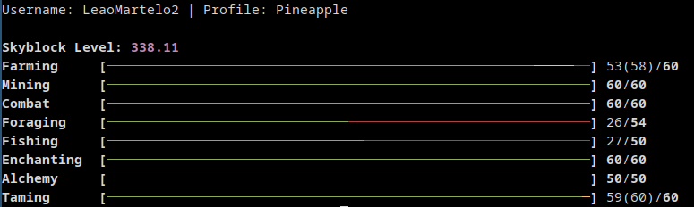

# Hypixel Skyblock profile viewer command line interface

> [!WARNING]
> This is still work in progress

> [!NOTE]
> You will require your own Hypixel API key for now




## Requireaments:

- libcurl
- clang and/or gcc

## How to compile

### .env method (recomended)
Create a `.env` file and fill it out:

```
HYPIXEL_API_KEY=<your_key_here>
```
either source the `.env` file, or allow `Make` to read from it.
Then run `make` normally


### Shell variables 

```
export HYPIXEL_API_KEY="<your_key_here>"
make 
```

### Make variable override

```
make API_KEY="<your_key_here>"
```

